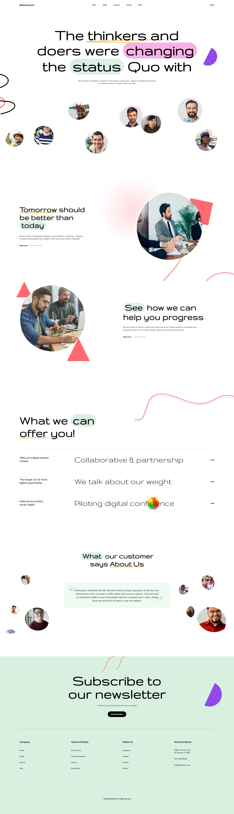

# Elementum Landing Page

A responsive React landing page developed from the provided Figma assignment design. The implementation focuses on design accuracy, clean component structure, responsive behavior, and production-ready Vite setup.

## Live Demo

Vercel: Add your live deployment link here

## Preview



## Design Reference

[View Figma Design](https://www.figma.com/design/0K35IOZ4Qwqur0b9o2PXlN/Assignment?node-id=0-1&t=Tdq2Ng34b481G6aS-1)

## Overview

This project converts the Elementum Figma design into a functional React webpage. The layout is divided into reusable sections and styled with custom CSS to match the original visual direction, including typography, spacing, imagery, decorative shapes, hover states, and responsive adjustments across screen sizes.

## Key Highlights

- Pixel-conscious implementation based on the supplied Figma design
- Fully responsive layout for desktop, tablet, and mobile viewports
- Reusable React components for each major page section
- Organized component-level CSS for maintainable styling
- Clean Vite project setup with fast local development and optimized production build
- Interactive navigation menu and subtle hover states

## Sections Implemented

- Navbar
- Hero section
- Offerings section
- Progress section
- Testimonials section
- Newsletter call-to-action
- Footer

## Tech Stack

- React
- Vite
- CSS3
- JavaScript

## Project Structure

```text
elementum-landing-page/
  public/
    favicon.svg
    icons.svg
  src/
    assets/
    components/
      Footer.jsx
      Hero.jsx
      Navbar.jsx
      Newsletter.jsx
      Offerings.jsx
      ProgressSection.jsx
      Testimonials.jsx
    App.jsx
    App.css
    index.css
    main.jsx
  index.html
  package.json
  vite.config.js
```

## Getting Started

Clone the repository:

```bash
git clone https://github.com/YOUR_USERNAME/elementum-figma-react-assignment.git
cd elementum-figma-react-assignment
```

Install dependencies:

```bash
npm install
```

Run the development server:

```bash
npm run dev
```

Create a production build:

```bash
npm run build
```

Preview the production build locally:

```bash
npm run preview
```

## Deployment

The project is ready to deploy on Vercel.

Recommended Vercel settings:

- Framework Preset: `Vite`
- Build Command: `npm run build`
- Output Directory: `dist`
- Install Command: `npm install`

## Repository Notes

The repository intentionally excludes generated and local-only files such as `node_modules`, `dist`, environment files, and editor settings. Required source files, public assets, and the README preview image are included.

## Author

Pratik
